# MCD en UML — AgriWater

**Modèle conceptuel de données (diagrammes de classes UML)** du projet **AgriWater** — Plateforme SaaS de gestion de l'irrigation, des ressources en eau et des campagnes maraîchères.

> **Source** : `CDC.md` (cahier des charges), notamment §6 (exigences fonctionnelles), §7 (règles métier), §12 (modèle de données).
> **Complémentarité** : le fichier `MCD.md` présente la même modélisation en notation **Chen** (`erDiagram`). Ce document reprend le modèle en **notation UML** (diagrammes de classes), enrichie des multiplicités, des énumérations et des contraintes d'intégrité.
> **Note de cohérence** : le dossier du dépôt s'appelle `Mamboly` alors que le CDC nomme le projet **AgriWater**. Les noms de classes suivent le CDC (`Farm`, `WaterSource`, …).

---

## 1. Conventions de notation UML

### 1.1 Stéréotypes et annotations

| Notation UML | Signification |
|---|---|
| `PK` | Primary Key — clé primaire |
| `FK` | Foreign Key — clé étrangère |
| `UQ` | contrainte d'unicité |
| `NN` | Non nul (`NOT NULL`) |
| `"derived"` | attribut ou méthode calculé(e), non stocké(e) en base |
| `<<enumeration>>` | type énuméré |

### 1.2 Visibilité

| Symbole | Visibilité | Usage dans le projet |
|---|---|---|
| `+` | public | attributs et méthodes exposés par le modèle |
| `#` | protected | attributs internes au modèle (masse assignable via `$fillable`) |
| `-` | private | attribut technique interne à la classe |

### 1.3 Multiplicités

| Notation | Lecture |
|---|---|
| `"1"` | exactement un |
| `"0..1"` | zéro ou un (clé étrangère **nullable**) |
| `"0..*"` | zéro ou plusieurs (aucune contrainte de minimum) |
| `"1..*"` | un ou plusieurs (**au moins un** : clé étrangère **non nulle**) |

Règle de lecture d'une association : *`A "x" --> "y" B : label`* signifie que **pour une instance de `A`, il existe `y` instances de `B`** et que **chaque instance de `B` est rattachée à exactement `x` instances de `A`**.

### 1.4 Types de données

| Type | Implémentation Laravel / SQL |
|---|---|
| `BigInt` | `bigint` — clé primaire |
| `String` | `varchar(...)` |
| `Text` | `text` |
| `Decimal` | `decimal(...)` — superficies, quantités, montants |
| `Int` | `integer` |
| `Boolean` | `boolean` |
| `Date` | `date` |
| `DateTime` | `timestamp` / `datetime` |
| `Time` | `time` |
| `Json` | `json` |
| `Enum` | `string` + validation Laravel `enum` (cf. § 10) |

### 1.5 Conventions de nommage

- Classes et tables en `PascalCase` (classe) / `snake_case` (table) ; tables au singulier.
- Clés étrangères nommées `<classeSingulier>_id`.
- Colonnes temporelles systématiques : `created_at`, `updated_at`.
- Les colonnes dénormalisées `farm_id` présentes sur les tables métier servent au filtrage d'isolation SaaS (**règle RM-01**) et sont maintenues cohérentes par modèle.

---

## 2. Vue d'ensemble — diagramme de classes avec packages

19 classes réparties en 7 packages. Le détail des attributs figure dans les sections suivantes ; ce diagramme met en évidence la **structure et les dépendances**.

```mermaid
classDiagram
    direction TB

    namespace Acces_Securite {
        class Role
        class User
        class Farm
    }

    namespace Exploitation_Agronomie {
        class Plot
        class Crop
        class Campaign
    }

    namespace Ressources_Eau {
        class WaterSource
        class WaterMovement
    }

    namespace Irrigation {
        class IrrigationSchedule
        class Irrigation
    }

    namespace Activites_Intrants {
        class Activity
        class Input
        class StockMovement
    }

    namespace Recoltes_Finances {
        class Harvest
        class Expense
        class Revenue
    }

    namespace Alertes_Tracabilite {
        class Alert
        class Notification
        class ActivityLog
    }

    Farm "1" --> "0..*" User : emploie
    Role "1" --> "0..*" User : attribue
    User "0..1" --> "0..1" Farm : dirige

    Farm "1" --> "0..*" Plot : decoupe
    Farm "1" --> "0..*" Campaign : pilote
    Plot "1" --> "0..*" Campaign : supporte
    Crop "1" --> "0..*" Campaign : typeDe
    User "0..1" --> "0..*" Campaign : dirige

    Farm "1" --> "0..*" WaterSource : possede
    WaterSource "1" --> "0..*" WaterMovement : trace
    Farm "1" --> "0..*" WaterMovement : cloisonne
    Campaign "0..1" --> "0..*" WaterMovement : impute
    User "1" --> "0..*" WaterMovement : enregistre

    Farm "1" --> "0..*" Irrigation : cloisonne
    Farm "1" --> "0..*" IrrigationSchedule : planifie
    Campaign "1" --> "0..*" Irrigation : concerne
    Plot "1" --> "0..*" Irrigation : irrigue
    WaterSource "1" --> "0..*" Irrigation : alimente
    User "1" --> "0..*" Irrigation : realise
    User "0..1" --> "0..*" Irrigation : valide
    Campaign "1" --> "0..*" IrrigationSchedule : planifiee
    Plot "1" --> "0..*" IrrigationSchedule : ciblee
    WaterSource "1" --> "0..*" IrrigationSchedule : prevue
    User "1" --> "0..*" IrrigationSchedule : assigneeA
    Irrigation "0..1" --> "0..1" WaterMovement : genere

    Farm "1" --> "0..*" Activity : cloisonne
    Plot "1" --> "0..*" Activity : porte
    Campaign "0..1" --> "0..*" Activity : concerne
    User "1" --> "0..*" Activity : realise
    Farm "1" --> "0..*" Input : stocke
    Input "1" --> "0..*" StockMovement : trace
    Farm "1" --> "0..*" StockMovement : cloisonne
    Campaign "0..1" --> "0..*" StockMovement : impute
    User "1" --> "0..*" StockMovement : enregistre

    Farm "1" --> "0..*" Harvest : detient
    Campaign "1" --> "0..*" Harvest : produit
    Plot "1" --> "0..*" Harvest : provient
    User "1" --> "0..*" Harvest : realise
    Farm "1" --> "0..*" Expense : cloisonne
    Campaign "0..1" --> "0..*" Expense : impute
    User "1" --> "0..*" Expense : enregistre
    Farm "1" --> "0..*" Revenue : cloisonne
    Campaign "0..1" --> "0..*" Revenue : impute
    Harvest "0..1" --> "0..*" Revenue : vend
    User "1" --> "0..*" Revenue : enregistre

    Farm "1" --> "0..*" Alert : surveille
    WaterSource "1" --> "0..*" Alert : declare
    Input "0..1" --> "0..*" Alert : declare
    Campaign "0..1" --> "0..*" Alert : concerne
    Farm "0..1" --> "0..*" ActivityLog : journalise
    User "0..1" --> "0..*" ActivityLog : auteur
```

### 2.1 Rôle de chaque classe

| # | Classe | Table | Rôle | Clé de partition |
|---|---|---|---|---|
| 1 | `Farm` | `farms` | Exploitations agricoles | — (racine) |
| 2 | `Role` | `roles` | Rôles et permissions | globale |
| 3 | `User` | `users` | Comptes utilisateurs | `farm_id` |
| 4 | `Plot` | `plots` | Parcelles maraîchères | `farm_id` |
| 5 | `Crop` | `crops` | Catalogue des cultures | globale |
| 6 | `Campaign` | `campaigns` | Cycles de production | `farm_id` |
| 7 | `WaterSource` | `water_sources` | Puits, citernes, bassins, réservoirs | `farm_id` |
| 8 | `WaterMovement` | `water_movements` | Historique traçable des mouvements d'eau | `farm_id` |
| 9 | `IrrigationSchedule` | `irrigation_schedules` | Planification des irrigations | `farm_id` |
| 10 | `Irrigation` | `irrigations` | Séances d'irrigation réalisées | `farm_id` |
| 11 | `Activity` | `activities` | Activités techniques | `farm_id` |
| 12 | `Input` | `inputs` | Intrants agricoles | `farm_id` |
| 13 | `StockMovement` | `stock_movements` | Mouvements d'intrants | `farm_id` |
| 14 | `Harvest` | `harvests` | Récoltes | `farm_id` |
| 15 | `Expense` | `expenses` | Dépenses | `farm_id` |
| 16 | `Revenue` | `revenues` | Recettes | `farm_id` |
| 17 | `Alert` | `alerts` | Alertes métier | `farm_id` |
| 18 | `Notification` | `notifications` | Notifications Laravel | technique |
| 19 | `ActivityLog` | `activity_logs` | Journal des opérations sensibles | `farm_id` |

Les classes 1 à 17 constituent le **modèle métier**. Les classes 18 et 19 sont techniques mais conservées pour la traçabilité exigée au § 18 du CDC.

---

## 3. Package `Acces_Securite` — Rôles, utilisateurs et exploitations

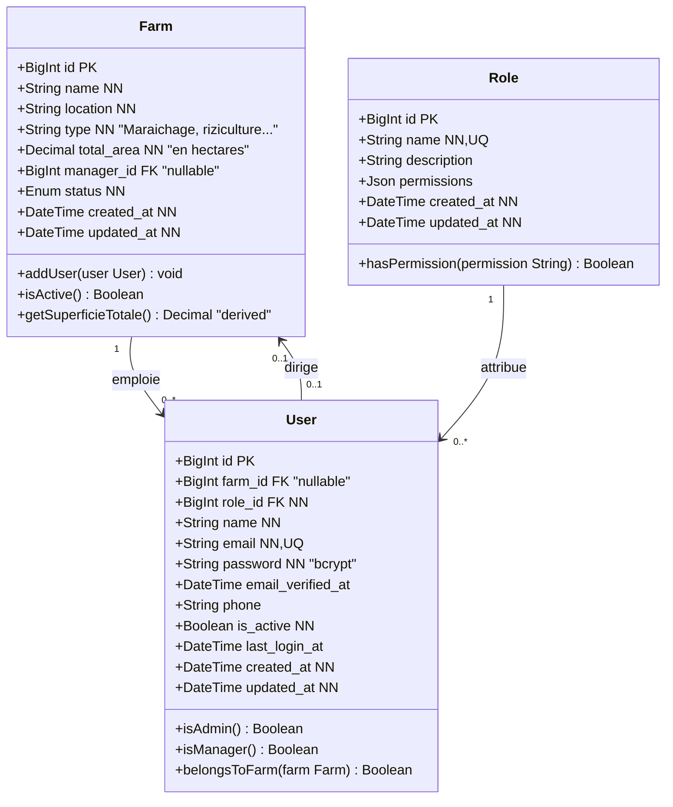

**Décision de modélisation — boucle `Farm.manager_id` ↔ `User.farm_id`.**

Le CDC exige à la fois « chaque exploitation possède un responsable » (§ 6.1) et « chaque utilisateur appartient à une exploitation, sauf l'administrateur global » (§ 6.2). Ces deux exigences créent une dépendance circulaire.

Choix retenu, conformément à la cible MySQL / PostgreSQL du CDC :

- `Farm.manager_id` est une **clé étrangère nullable** vers `User`, ajoutée par une migration distincte, après la création de `users`.
- `User.farm_id` est **nullable** : un administrateur global n'appartient à aucune exploitation (`"0..1"`).
- Le responsable est aussi un utilisateur rattaché à sa propre exploitation ; les deux valeurs sont contrôlées par une validation applicative.

**Héritage des rôles** : les trois profils du CDC (administrateur, responsable d'exploitation, agent agricole) sont modélisés par l'attribut `Role.name` et non par une hiérarchie d'héritage, conformément à la table `roles` du § 12 du CDC.

---

## 4. Package `Exploitation_Agronomie` — Parcelles, cultures et campagnes

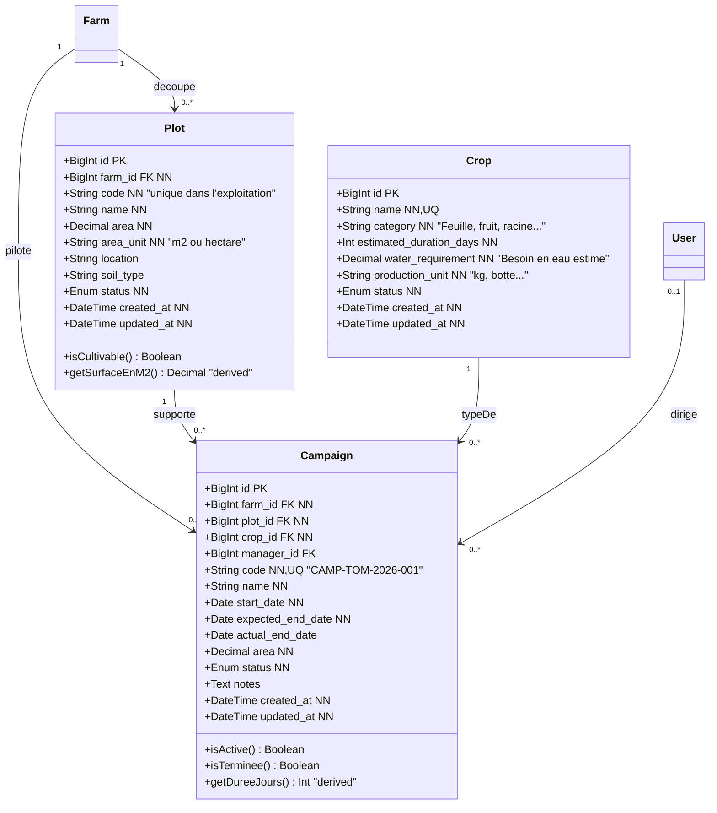

**Contraintes**

- `UQ (farm_id, code)` sur `Plot` : le code de parcelle est unique **dans l'exploitation** (§ 6.3), pas globalement.
- `UQ (farm_id, code)` sur `Campaign` : même logique pour la référence de campagne.
- `Campaign.plot_id` est cohérent avec `Campaign.farm_id` (la parcelle appartient à la même exploitation) — contrôlé par validation applicative.

**Attributs dérivés**

- `Plot.getSurfaceEnM2()` : normalisation de `area` selon `area_unit`, nécessaire au calcul de l'indicateur « consommation par m² » (§ 9.2 du CDC).
- `Campaign.getDureeJours()` : différence entre `start_date` et `expected_end_date` (ou `actual_end_date`).

**Score de priorité d'irrigation (§ 6.10 du CDC)**

Le score n'est **pas** stocké dans `Plot` : il est recalculé à la demande en croisant `Plot` avec un agrégat des `irrigations` validées de la parcelle, une politique d prioritizing (`PriorityIrrigationService`) et la disponibilité de la ressource en eau.

```
Score = (Jours sans irrigation × 4) + Besoin de la culture + Priorité manuelle
```

---

## 5. Package `Ressources_Eau` — Réserves et mouvements

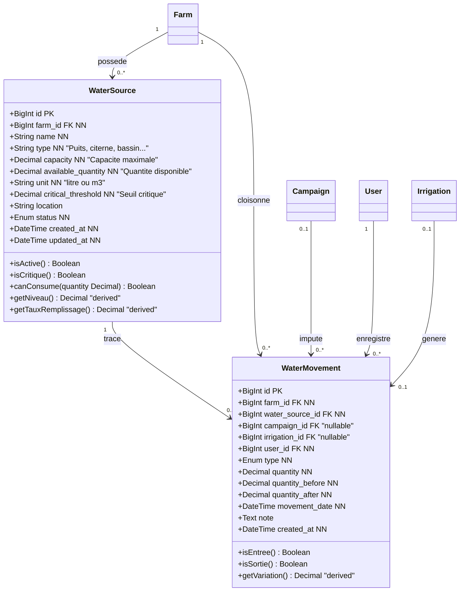

**Invariants de la classe `WaterSource`**

```
0 <= available_quantity <= capacity
available_quantity >= 0                        (RM-04)
available_quantity <= capacity                 (RM-05)
isCritique()  <=>  available_quantity <= critical_threshold   (RM-08)
```

**Rôle de `WaterMovement`** — journal d'audit append-only de toute variation de `WaterSource.available_quantity` (**règle RM-09** : toute consommation validée génère automatiquement un mouvement traçable). Les colonnes `quantity_before` / `quantity_after` permettent de reconstituer l'état de la réserve à n'importe quel instant et de détecter les écarts.

**Types de mouvements (§ 6.7 du CDC)** : `stock_initial`, `remplissage`, `ajout_manuel`, `consommation`, `perte`, `ajustement`, `correction`, `vidange`, `transfert`.

---

## 6. Package `Irrigation` — Planification et réalisation

C'est le cœur fonctionnel du projet (CDC § 6.8, § 6.9).

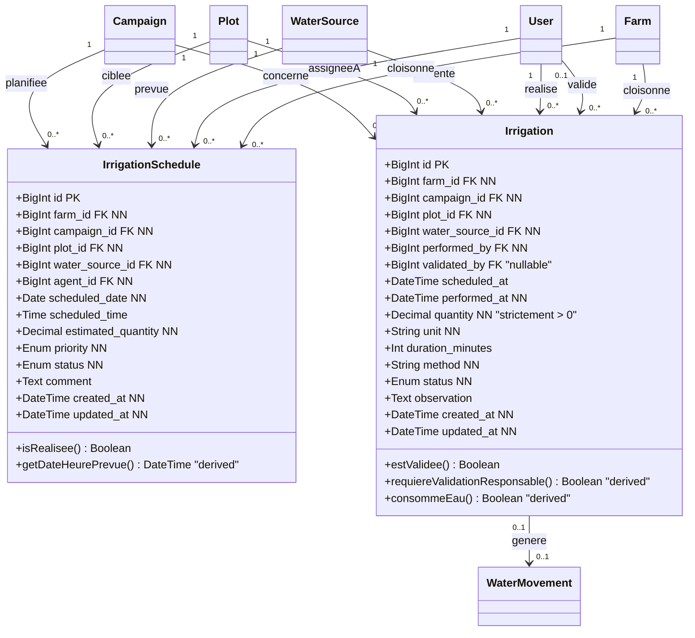

**Contraintes**

```
RM-02  WaterSource.status == active           (ressource en eau obligatoire)
RM-03  Irrigation.quantity > 0
RM-04  WaterSource.available_quantity >= Irrigation.quantity
RM-06  Campaign.status in (active, ...)      (campagne active obligatoire)
RM-07  Irrigation.plot_id == Campaign.plot_id (coherence parcelle-campagne)
RM-09  toute irrigation consommee  ->  1 WaterMovement type = consommation
RM-10  quantity > 2000 L  ->  validated_by NOT NULL
```

**Différence entre `IrrigationSchedule` et `Irrigation`**

| | `IrrigationSchedule` | `Irrigation` |
|---|---|---|
| Nature | **intention** (prévision) | **fait** (réalité) |
| Volume | `estimated_quantity` (estimé) | `quantity` (constaté) |
| Date | `scheduled_date` + `scheduled_time` | `performed_at` |
| Effet sur le stock d'eau | aucun | décrémente `WaterSource.available_quantity` |
| Rattachement | `agent_id` (assigné) | `performed_by` (exécutant) + `validated_by` (validateur) |

**Statuts d'une irrigation (§ 6.8)** : `brouillon` → `planifiee` → `en_attente_validation` → `validee` → `realisee`, plus `annulee` et `refusee`.

**Machine à états du statut**

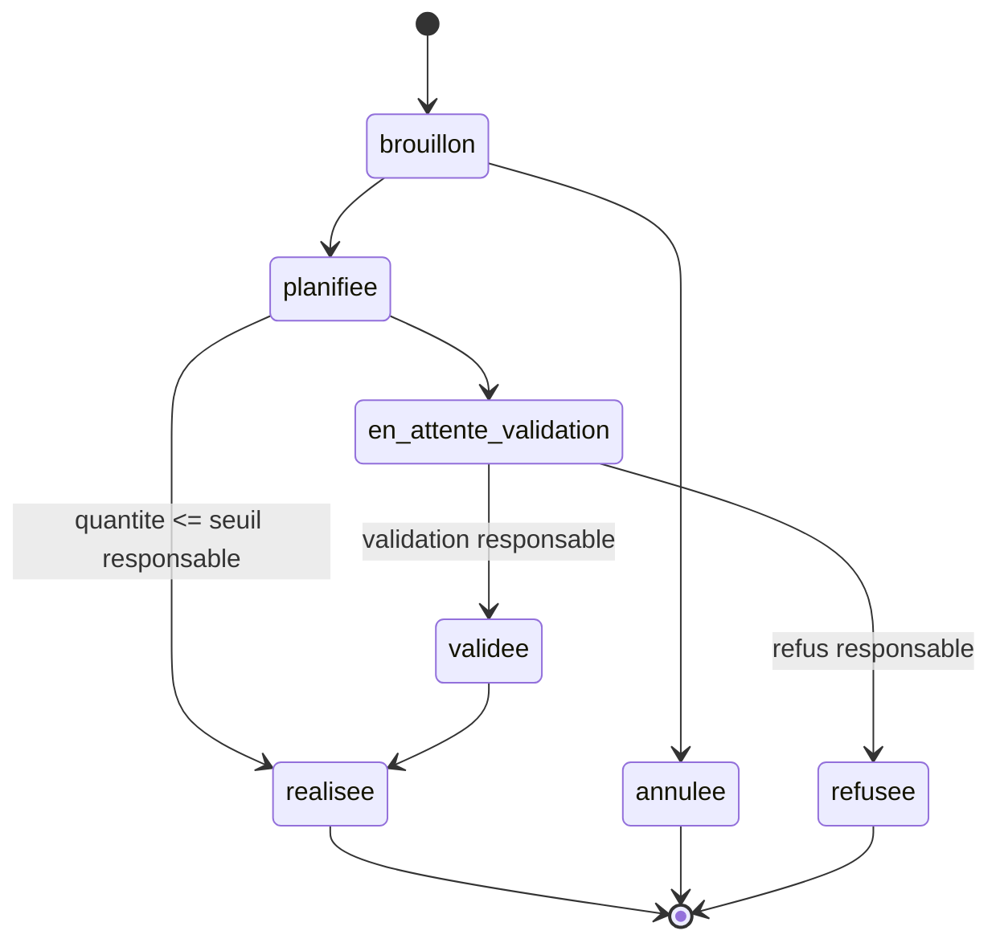

---

## 7. Package `Activites_Intrants` — Activités techniques, intrants et stocks

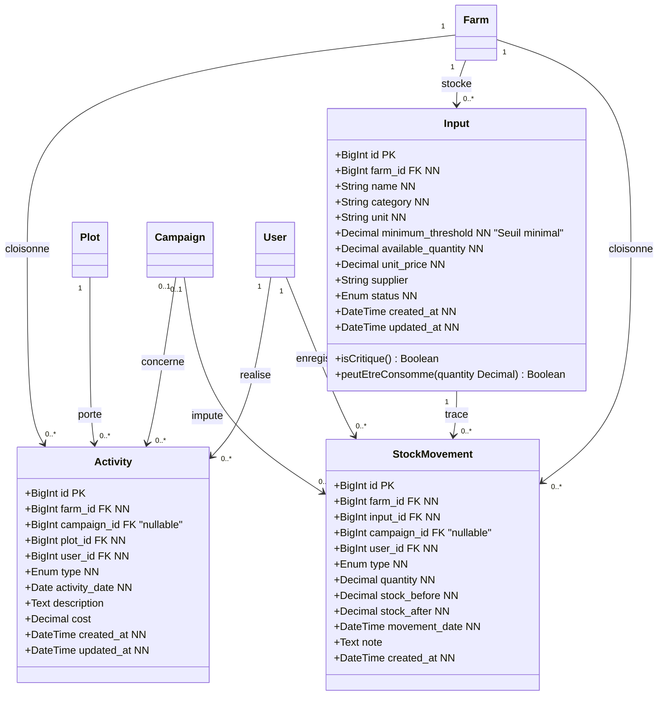

**Contraintes**

```
RM-11  Campaign.status != terminee  ->  pas de nouvelle Activity / Expense / Irrigation
RM-12  Input.available_quantity >= 0   (stock d'intrant non negatif)
       Input.isCritique() <=> available_quantity <= minimum_threshold
```

**Types d'activités techniques (§ 6.11 du CDC)** : `preparation_sol`, `semis`, `repiquage`, `fertilisation`, `traitement`, `desherbage`, `irrigation`, `entretien`, `recolte`, `observation`, `nettoyage`, `autre`.

> Une irrigation validée crée automatiquement une `Activity` de type `irrigation` (CDC § 8.1), à l'intérieur de la même transaction.

---

## 8. Package `Recoltes_Finances` — Récoltes, dépenses et recettes

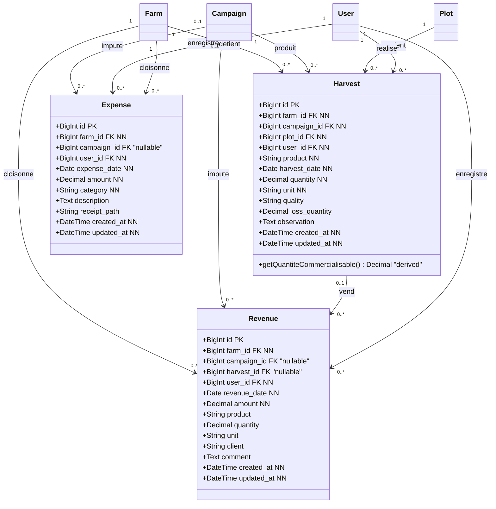

**Contraintes**

```
RM-13  si Revenue.harvest_id NOT NULL :
         Revenue.quantity <= Harvest.quantity - SUM(revenues liees a cette recolte)
```

**Indicateur financier**

```
Marge simplifiée = SUM(Revenue.amount) - SUM(Expense.amount)
```

Cet agrégat est calculé par `FinanceService` et mis en cache par exploitation et par mois (`farm:{farmId}:dashboard`).

---

## 9. Package `Alertes_Tracabilite` — Alertes, notifications et journal

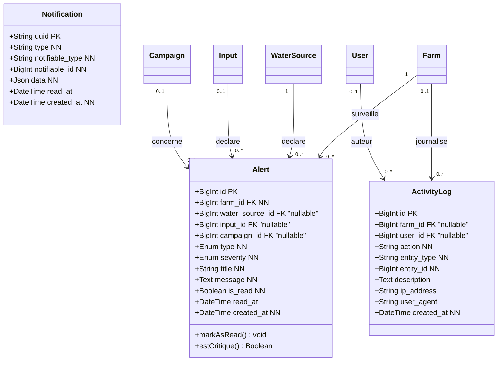

**Déclenchement d'une alerte (règle RM-08)**

```
WaterSource.available_quantity <= WaterSource.critical_threshold
        -> evenement WaterLevelCritical
        -> CreateWaterAlertListener      : creation de Alert (type = eau_critique)
        -> NotifyFarmManagerListener     : Notification au responsable (canal database)
        -> LogCriticalWaterLevelListener : ecriture dans les logs
```

`Alert.water_source_id`, `Alert.input_id` et `Alert.campaign_id` sont mutuellement exclusifs : une alerte porte sur un seul objet. Les trois clés étrangères sont donc nullable (`"0..1"`).

**Opérations journalisées dans `ActivityLog` (§ 18 du CDC)** : tentative d'accès à une autre exploitation, création / modification / suppression d'une ressource en eau, irrigation validée, irrigation refusée pour eau insuffisante, ajustement manuel de stock, alerte de niveau critique, erreur de traitement asynchrone.

---

## 10. Types énumérés

Les énumérations sont stockées en `varchar` et validées côté Laravel par la règle `enum` (aucune table de référence, conformément au volume de tables attendu au § 12 du CDC).

```mermaid
classDiagram
    class StatutExploitation {
        <<enumeration>>
        active
        suspendue
        inactive
    }

    class StatutParcelle {
        <<enumeration>>
        disponible
        en_culture
        en_repos
        indisponible
    }

    class StatutCulture {
        <<enumeration>>
        actif
        inactif
    }

    class StatutCampagne {
        <<enumeration>>
        planifiee
        active
        suspendue
        terminee
        annulee
    }

    class TypeRessourceEau {
        <<enumeration>>
        puits
        citerne
        bassin
        reservoir
        canal
        riviere
        reserve_pluie
    }

    class StatutRessourceEau {
        <<enumeration>>
        active
        maintenance
        indisponible
    }

    class TypeMouvementEau {
        <<enumeration>>
        stock_initial
        remplissage
        ajout_manuel
        consommation
        perte
        ajustement
        correction
        vidange
        transfert
    }

    class StatutIrrigation {
        <<enumeration>>
        brouillon
        planifiee
        en_attente_validation
        validee
        realisee
        annulee
        refusee
    }

    class MethodeIrrigation {
        <<enumeration>>
        arrosage_manuel
        goutte_a_goutte
        aspersion
        gravitaire
        tuyau
        pompe
        autre
    }

    class Priorite {
        <<enumeration>>
        faible
        normale
        elevee
        critique
    }

    class StatutPlanification {
        <<enumeration>>
        planifiee
        realisee
        reportee
        annulee
    }

    class TypeActivite {
        <<enumeration>>
        preparation_sol
        semis
        repiquage
        fertilisation
        traitement
        desherbage
        irrigation
        entretien
        recolte
        observation
        nettoyage
        autre
    }

    class CategorieIntrant {
        <<enumeration>>
        semence
        engrais
        compost
        produit_phytosanitaire
        carburant
        consommable
        tuyau
        piece_pompe
        traitement_eau
    }

    class TypeMouvementStock {
        <<enumeration>>
        stock_initial
        entree
        sortie
        consommation
        ajustement
    }

    class CategorieDepense {
        <<enumeration>>
        semences
        engrais
        carburant
        reparation_pompe
        materiel
        main_oeuvre
        transport
        energie_electrique
        achat_eau
        traitement
    }

    class TypeAlerte {
        <<enumeration>>
        eau_critique
        stock_critique
        campagne_a_risque
        systeme
    }

    class SeveriteAlerte {
        <<enumeration>>
        info
        avertissement
        critique
    }
```

### 10.1 Correspondance énumération ↔ attribut

| Énumération | Attribut | Classe(s) |
|---|---|---|
| `StatutExploitation` | `Farm.status` | Farm |
| `StatutParcelle` | `Plot.status` | Plot |
| `StatutCulture` | `Crop.status` | Crop |
| `StatutCampagne` | `Campaign.status` | Campaign |
| `TypeRessourceEau` | `WaterSource.type` | WaterSource |
| `StatutRessourceEau` | `WaterSource.status` | WaterSource |
| `TypeMouvementEau` | `WaterMovement.type` | WaterMovement |
| `StatutIrrigation` | `Irrigation.status` | Irrigation |
| `MethodeIrrigation` | `Irrigation.method` | Irrigation |
| `Priorite` | `IrrigationSchedule.priority` | IrrigationSchedule |
| `StatutPlanification` | `IrrigationSchedule.status` | IrrigationSchedule |
| `TypeActivite` | `Activity.type` | Activity |
| `CategorieIntrant` | `Input.category` | Input |
| `TypeMouvementStock` | `StockMovement.type` | StockMovement |
| `CategorieDepense` | `Expense.category` | Expense |
| `TypeAlerte` | `Alert.type` | Alert |
| `SeveriteAlerte` | `Alert.severity` | Alert |

---

## 11. Catalogue des associations et cardinalités

| # | Classe source | Multiplicité | Classe cible | Rôle de la cible | FK | Nullable |
|---|---|---|---|---|---|---|
| 1 | `Farm` | 1 | `User` | emploie | `users.farm_id` | oui (admin global) |
| 2 | `Role` | 1 | `User` | attribue | `users.role_id` | non |
| 3 | `User` | 0..1 | `Farm` | dirige | `farms.manager_id` | oui |
| 4 | `Farm` | 1 | `Plot` | découpe | `plots.farm_id` | non |
| 5 | `Farm` | 1 | `Campaign` | pilote | `campaigns.farm_id` | non |
| 6 | `Plot` | 1 | `Campaign` | supporte | `campaigns.plot_id` | non |
| 7 | `Crop` | 1 | `Campaign` | type de | `campaigns.crop_id` | non |
| 8 | `User` | 0..1 | `Campaign` | dirige | `campaigns.manager_id` | oui |
| 9 | `Farm` | 1 | `WaterSource` | possède | `water_sources.farm_id` | non |
| 10 | `WaterSource` | 1 | `WaterMovement` | trace | `water_movements.water_source_id` | non |
| 11 | `Campaign` | 0..1 | `WaterMovement` | impute | `water_movements.campaign_id` | oui |
| 12 | `User` | 1 | `WaterMovement` | enregistre | `water_movements.user_id` | non |
| 13 | `Irrigation` | 0..1 | `WaterMovement` | génère | `water_movements.irrigation_id` | oui |
| 14 | `Campaign` | 1 | `Irrigation` | concerne | `irrigations.campaign_id` | non |
| 15 | `Plot` | 1 | `Irrigation` | irrigue | `irrigations.plot_id` | non |
| 16 | `WaterSource` | 1 | `Irrigation` | alimente | `irrigations.water_source_id` | non |
| 17 | `User` | 1 | `Irrigation` | réalise | `irrigations.performed_by` | non |
| 18 | `User` | 0..1 | `Irrigation` | valide | `irrigations.validated_by` | oui |
| 19 | `Campaign` | 1 | `IrrigationSchedule` | planifiée | `irrigation_schedules.campaign_id` | non |
| 20 | `Plot` | 1 | `IrrigationSchedule` | ciblée | `irrigation_schedules.plot_id` | non |
| 21 | `WaterSource` | 1 | `IrrigationSchedule` | prévue | `irrigation_schedules.water_source_id` | non |
| 22 | `User` | 1 | `IrrigationSchedule` | assignée à | `irrigation_schedules.agent_id` | non |
| 23 | `Plot` | 1 | `Activity` | porte | `activities.plot_id` | non |
| 24 | `Campaign` | 0..1 | `Activity` | concerne | `activities.campaign_id` | oui |
| 25 | `User` | 1 | `Activity` | réalise | `activities.user_id` | non |
| 26 | `Farm` | 1 | `Input` | stocke | `inputs.farm_id` | non |
| 27 | `Input` | 1 | `StockMovement` | trace | `stock_movements.input_id` | non |
| 28 | `Campaign` | 0..1 | `StockMovement` | impute | `stock_movements.campaign_id` | oui |
| 29 | `Farm` | 1 | `Harvest` | produit | `harvests.farm_id` | non |
| 30 | `Campaign` | 1 | `Harvest` | produit | `harvests.campaign_id` | non |
| 31 | `Plot` | 1 | `Harvest` | provient | `harvests.plot_id` | non |
| 32 | `Campaign` | 0..1 | `Expense` | impute | `expenses.campaign_id` | oui |
| 33 | `Campaign` | 0..1 | `Revenue` | impute | `revenues.campaign_id` | oui |
| 34 | `Harvest` | 0..1 | `Revenue` | vend | `revenues.harvest_id` | oui |
| 35 | `Farm` | 1 | `Alert` | surveille | `alerts.farm_id` | non |
| 36 | `WaterSource` | 1 | `Alert` | déclare | `alerts.water_source_id` | oui |
| 37 | `Input` | 0..1 | `Alert` | déclare | `alerts.input_id` | oui |
| 38 | `Campaign` | 0..1 | `Alert` | concerne | `alerts.campaign_id` | oui |
| 39 | `Farm` | 0..1 | `ActivityLog` | journalise | `activity_logs.farm_id` | oui |
| 40 | `User` | 0..1 | `ActivityLog` | auteur | `activity_logs.user_id` | oui |
| 41 | `Farm` | 1 | `WaterMovement` | cloisonne | `water_movements.farm_id` | non |
| 42 | `Farm` | 1 | `Irrigation` | cloisonne | `irrigations.farm_id` | non |
| 43 | `Farm` | 1 | `IrrigationSchedule` | cloisonne | `irrigation_schedules.farm_id` | non |
| 44 | `Farm` | 1 | `Activity` | cloisonne | `activities.farm_id` | non |
| 45 | `Farm` | 1 | `StockMovement` | cloisonne | `stock_movements.farm_id` | non |
| 46 | `Farm` | 1 | `Expense` | cloisonne | `expenses.farm_id` | non |
| 47 | `Farm` | 1 | `Revenue` | cloisonne | `revenues.farm_id` | non |
| 48 | `User` | 1 | `Expense` | enregistre | `expenses.user_id` | non |
| 49 | `User` | 1 | `Revenue` | enregistre | `revenues.user_id` | non |
| 50 | `User` | 1 | `StockMovement` | enregistre | `stock_movements.user_id` | non |
| 51 | `User` | 1 | `Harvest` | realise | `harvests.user_id` | non |

> **Associations 41 à 51.** Ces clés étrangères n'apparaissent pas dans le CDC § 12 mais sont nécessaires à l'implémentation : les lignes 41 à 47 matérialisent le **cloisonnement SaaS** (règle RM-01) par une colonne dénormalisée `farm_id` sur chaque table enfantine, et les lignes 48 à 51 rattachent l'**utilisateur auteur** de chaque opération (traçabilité). Elles sont maintenues par le trait Laravel `BelongsToFarm` et par les triggers § 6.10 du schéma.

### 11.1 Politique d'intégrité référentielle

| Classe cible | FK | `onDelete` |
|---|---|---|
| `User` | `users.farm_id` | `SET NULL` (le compte est désactivé, pas supprimé) |
| `Farm` | `farms.manager_id` | `SET NULL` avant suppression du compte |
| `Plot`, `Campaign`, `WaterSource`, `Input` | `*.farm_id` | `CASCADE` (suppression de l'exploitation) |
| `Campaign` | `campaigns.plot_id` | `RESTRICT` (parcelle exploitée) |
| `Campaign` | `campaigns.crop_id` | `RESTRICT` |
| `Irrigation`, `WaterMovement` | `*.campaign_id`, `*.plot_id`, `*.water_source_id` | `RESTRICT` (traçabilité) |
| `WaterMovement` | `water_movements.irrigation_id` | `CASCADE` (redondance maîtrisée) |
| `Expense`, `Revenue`, `Activity`, `StockMovement` | `*.campaign_id` | `SET NULL` (opération conservée) |
| `Revenue` | `revenues.harvest_id` | `SET NULL` |

---

## 12. Contraintes d'intégrité — traduction des règles métier

| Règle | Formulation | Implémentation |
|---|---|---|
| **RM-01** Isolation des exploitations | Un utilisateur de l'exploitation A ne lit/modifie/supprime rien de l'exploitation B | Scope global `BelongsToFarm` sur les modèles métier + Policies Laravel + `where('farm_id', $user->farm_id)` |
| **RM-02** Ressource obligatoire | Toute irrigation validée est liée à une ressource active | `WaterSource.status == active` validé dans `IrrigationService` |
| **RM-03** Quantité positive | `Irrigation.quantity > 0` | `FormRequest` `['required','numeric','gt:0']` |
| **RM-04** Pas de stock négatif | `quantity demandée <= quantité disponible` | `lockForUpdate()` + `InsufficientWaterException` → HTTP 409 |
| **RM-05** Capacité max | `disponible + ajouté <= capacité` | `WaterStockService::refill()` |
| **RM-06** Campagne active | Irrigation sur campagne active | `Campaign::where('status','active')` |
| **RM-07** Cohérence parcelle/campagne | `Irrigation.plot_id == Campaign.plot_id` | Validation croisée dans le `FormRequest` |
| **RM-08** Alerte critique | `disponible <= seuil critique` | Événement `WaterLevelCritical` |
| **RM-09** Traçabilité | Toute consommation validée génère un mouvement | Création de `WaterMovement` dans la même transaction |
| **RM-10** Validation responsable | Volume > seuil (ex. 2 000 L) ⇒ validation obligatoire | `Irrigation.requiereValidationResponsable()` |
| **RM-11** Campagne terminée | Aucune nouvelle irrigation / dépense / activité | Guard dans `CampaignPolicy` + `CampaignService` |
| **RM-12** Stock d'intrant non négatif | `consommation <= stock disponible` | `StockMovementService` |
| **RM-13** Recette et récolte | `quantité vendue <= quantité récoltée disponible` | Agrégat sur `revenues.harvest_id` |

---

## 13. Diagramme de séquence UML — validation transactionnelle d'une irrigation

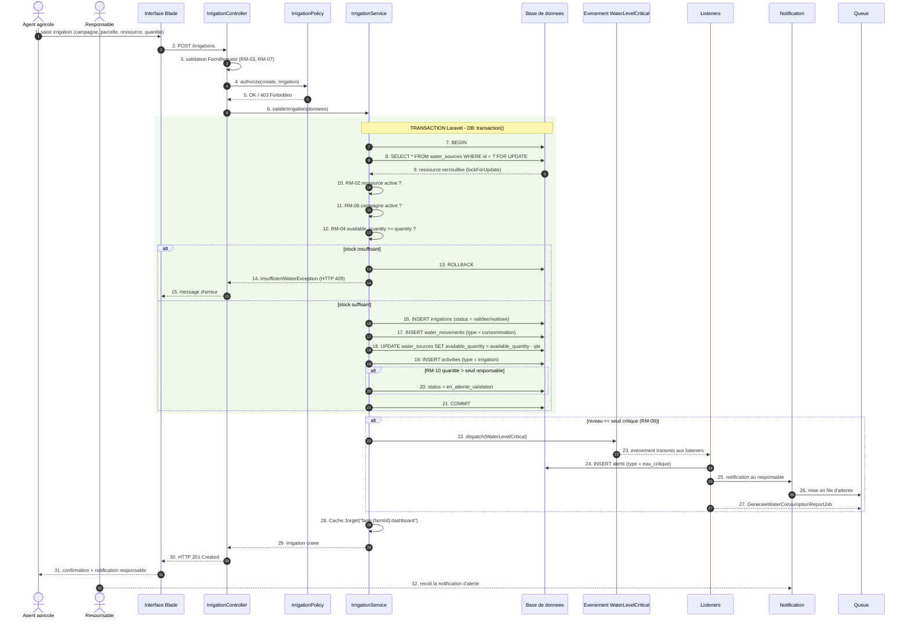

### 13.1 Scénario de concurrence (CDC § 8.3)

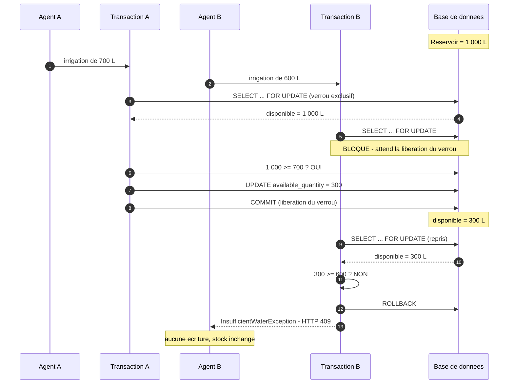

---

## 14. Diagramme d'activité UML — flux transactionnel d'irrigation

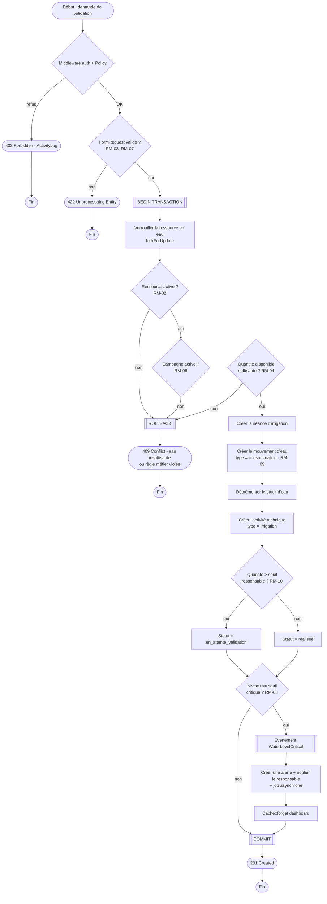

**Garantie obtained** : si une seule étape échoue, le `ROLLBACK` annule **simultanément** la séance d'irrigation, le mouvement d'eau, la mise à jour du stock et l'activité technique. Aucune donnée partielle n'est jamais persistée.

---

## 15. Mapping UML ↔ Laravel

### 15.1 Classes ↔ modèles Eloquent

| Classe UML | Modèle Eloquent | Trait / scope |
|---|---|---|
| `Farm` | `App\Models\Farm` | `HasFactory` |
| `Role` | `App\Models\Role` | — |
| `User` | `App\Models\User` | `HasFactory`, `Notifiable` |
| `Plot` | `App\Models\Plot` | `BelongsToFarm` |
| `Crop` | `App\Models\Crop` | `HasFactory` |
| `Campaign` | `App\Models\Campaign` | `BelongsToFarm` |
| `WaterSource` | `App\Models\WaterSource` | `BelongsToFarm` |
| `WaterMovement` | `App\Models\WaterMovement` | `BelongsToFarm` |
| `IrrigationSchedule` | `App\Models\IrrigationSchedule` | `BelongsToFarm` |
| `Irrigation` | `App\Models\Irrigation` | `BelongsToFarm` |
| `Activity` | `App\Models\Activity` | `BelongsToFarm` |
| `Input` | `App\Models\Input` | `BelongsToFarm` |
| `StockMovement` | `App\Models\StockMovement` | `BelongsToFarm` |
| `Harvest` | `App\Models\Harvest` | `BelongsToFarm` |
| `Expense` | `App\Models\Expense` | `BelongsToFarm` |
| `Revenue` | `App\Models\Revenue` | `BelongsToFarm` |
| `Alert` | `App\Models\Alert` | `BelongsToFarm` |
| `Notification` | framework Laravel | — |
| `ActivityLog` | `App\Models\ActivityLog` | `BelongsToFarm` |

### 15.2 Services métier responsable des invariants

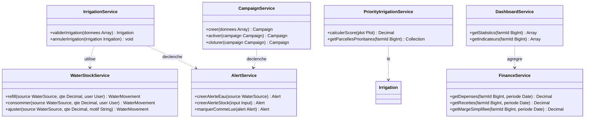

### 15.3 Policies associées aux classes

| Classe | Policy | Vérifie notamment |
|---|---|---|
| `Farm` | `FarmPolicy` | `viewAny`, `update`, `delete` |
| `Plot` | `PlotPolicy` | même `farm_id` (**RM-01**) |
| `Campaign` | `CampaignPolicy` | RM-01, RM-11 |
| `WaterSource` | `WaterSourcePolicy` | RM-01, RM-05 |
| `Irrigation` | `IrrigationPolicy` | RM-01, RM-10 |
| `Expense` | `ExpensePolicy` | RM-01, RM-11 |
| `Revenue` | `RevenuePolicy` | RM-01 |

---

## 16. Diagramme de packages — organisation fonctionnelle

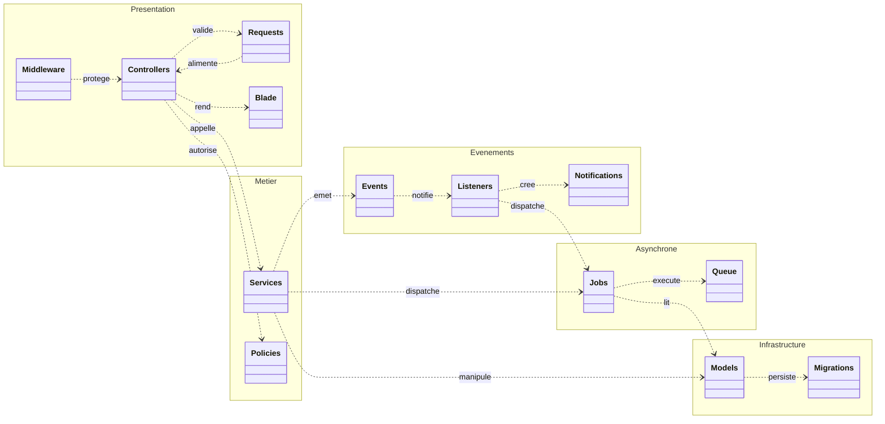

---

## 17. Vérification de la cohérence du modèle

| Contrôle | Résultat |
|---|---|
| Nombre de tables métier | 18 tables applicatives (17 entités métier + `activity_logs`), plus 8 tables techniques Laravel |
| Toutes les tables métier portent `farm_id` | ✔ (RM-01) — 15 tables cloisonnées |
| Nombre total d'associations | 51 clés étrangères, toutes décrites au § 11 |
| Toutes les clés étrangères du § 12 du CDC sont présentes | ✔ `manager_id`, `plot_id`, `crop_id`, `water_source_id`, `campaign_id`, `irrigation_id`, `user_id`, `validated_by`, `performed_by`, `agent_id`, `input_id`, `harvest_id` |
| Contrainte principale du CDC respectée | ✔ `WaterSource.available_quantity >= 0` garantie par `CHECK`, transaction et verrouillage |
| Boucle `Farm ↔ User` traitée | ✔ deux clés étrangères nullable |
| Module personnel modélisé | ✔ score de priorité en attribut dérivé + vue `v_irrigation_priority` |
| Regroupement des FK nullable | ✔ 13 associations en `"0..1"` sur 51 (colonnes § 11) |