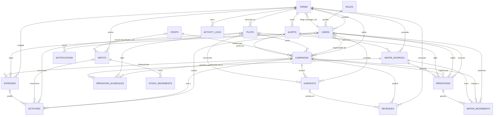
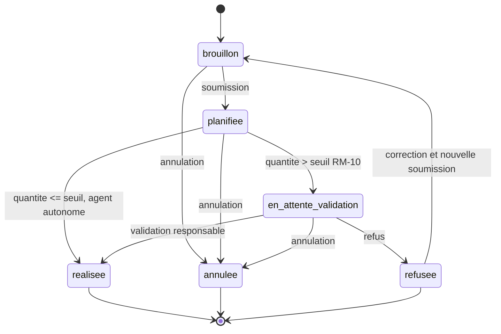
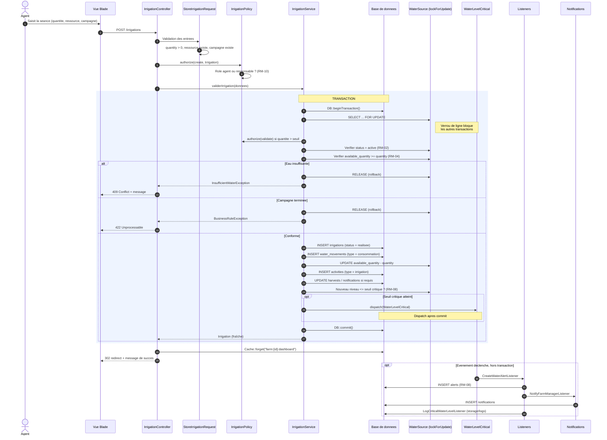
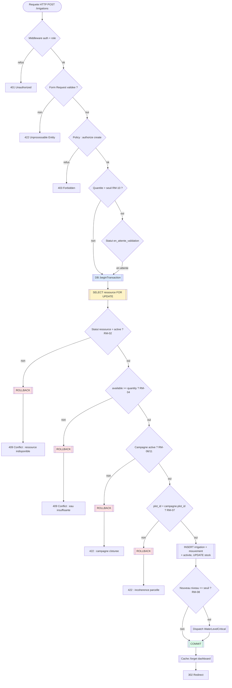

# MCD — Modèle conceptuel de données

**Projet : AgriWater** — Plateforme SaaS de gestion de l'irrigation, des ressources en eau et des campagnes maraîchères.

> Source : `CDC.md` (cahier des charges). Ce document en déduit le modèle de données.
> **Note de cohérence** : le dossier du dépôt s'appelle `Mamboly` alors que le CDC nomme le projet **AgriWater**. Les noms de tables ci-dessous suivent le CDC (`farms`, `water_sources`, …). Voir § 9 pour la décision à trancher.

---

## 1. Conventions

| Notation | Signification |
|---|---|
| `PK` | Clé primaire |
| `FK` | Clé étrangère |
| `UQ` | Contrainte d'unicité |
| `NN` | Non nul |
| `PK, FK` | Colonne participant aux deux rôles |

Cardinalités employées :

| Notation Mermaid | Lecture |
|---|---|
| `\|\|--o{` | Un et un à zéro ou plusieurs |
| `\|\|--\|` | Un et un exactement |
| `o\|--o{` | Zéro ou un vers zéro ou plusieurs |
| `}\|--o{` | Une vers zéro ou plusieurs (obligatoire côté gauche) |

Conventions de nommage :

- Tables et colonnes en `snake_case`, au singulier pour les tables.
- Clés étrangères nommées `<table_singulier>_id`.
- Colonnes temporelles : `created_at`, `updated_at` (`timestamp`, `NN`).
- Les colonnes dénormalisées `farm_id` présentes sur les tables métier servent au filtrage d'isolation SaaS (règle RM-01) et sont maintenues cohérentes par modèle.
- Les champs d'énumération sont stockés en `string` (max 50) et validés par `enum` PHP ; aucune table `lookup` n'est créée, conformément au volume de tables attendu.

---

## 2. Vue d'ensemble : 19 tables

| # | Table | Rôle | Contrainte de partition |
|---|---|---|---|
| 1 | `farms` | Exploitations agricoles | — (racine) |
| 2 | `roles` | Rôles et permissions | globale |
| 3 | `users` | Comptes utilisateurs | `farm_id` |
| 4 | `plots` | Parcelles | `farm_id` |
| 5 | `crops` | Catalogue des cultures | globale |
| 6 | `campaigns` | Cycles de production | `farm_id` |
| 7 | `water_sources` | Puits, citernes, bassins | `farm_id` |
| 8 | `water_movements` | Historique des mouvements d'eau | `farm_id` |
| 9 | `irrigation_schedules` | Planification des irrigations | `farm_id` |
| 10 | `irrigations` | Séances d'irrigation | `farm_id` |
| 11 | `activities` | Activités techniques | `farm_id` |
| 12 | `inputs` | Intrants agricoles | `farm_id` |
| 13 | `stock_movements` | Mouvements d'intrants | `farm_id` |
| 14 | `expenses` | Dépenses | `farm_id` |
| 15 | `revenues` | Recettes | `farm_id` |
| 16 | `harvests` | Récoltes | `farm_id` |
| 17 | `alerts` | Alertes métier | `farm_id` |
| 18 | `notifications` | Notifications Laravel | technique |
| 19 | `activity_logs` | Journal des opérations sensibles | `farm_id` |

Les tables 1 à 17 constituent le modèle métier. Les tables 18 et 19 sont techniques (Laravel) mais sont conservées dans le modèle pour la traçabilité exigée au § 18 du CDC.

---

## 3. Diagramme entité-relations global



> `CROPS o|--o{ INPUTS` matérialise le champ facultatif « fournisseur » de la section 6.12 du CDC. `EXPENSES o|--o{ ACTIVITIES` matérialise le rattachement d'une activité à sa dépense de main-d'œuvre. `HARVESTS o|--o{ REVENUES` matérialise le contrôle de la règle RM-13.

---

## 4. Sous-modèles détaillés

### 4.1 Sécurité, rôles et exploitations

```mermaid
erDiagram
    FARMS ||--o{ USERS : "emploie"
    ROLES ||--o{ USERS : "attribue"
    USERS o|--o| FARMS : "manager_id"

    FARMS {
        bigint id PK
        string name NN "Nom de l'exploitation"
        string location NN "Localisation"
        string type NN "Maraichage, riziculture..."
        decimal total_area NN "Superficie totale (ha)"
        bigint manager_id FK "Responsable"
        string status NN "active, suspendue, inactive"
        timestamp created_at NN
        timestamp updated_at NN
    }

    ROLES {
        bigint id PK
        string name NN "administrateur, responsable, agent"
        string description
        json permissions "Droits fins"
        timestamp created_at NN
        timestamp updated_at NN
    }

    USERS {
        bigint id PK
        bigint farm_id FK "NN sauf admin global"
        bigint role_id FK NN
        string name NN
        string email NN,UQ
        string password NN "hash bcrypt"
        timestamp email_verified_at
        string phone
        boolean is_active NN,default "true"
        timestamp last_login_at
        timestamp created_at NN
        timestamp updated_at NN
    }
```

**Décision de modélisation — boucle `farms.manager_id` ↔ `users.farm_id`.**

Le CDC exige à la fois « chaque exploitation possède un responsable » (§ 6.1) et « chaque utilisateur appartient à une exploitation, sauf l'administrateur global » (§ 6.2). Ces deux exigences créent une dépendance circulaire : `farms` référence `users`, `users` référence `farms`.

Choix retenu, conformément à la cible MySQL / PostgreSQL du CDC :

- `farms.manager_id` est une **clé étrangère nullable** vers `users.id`, ajoutée par une migration distincte, après la création de `users`.
- `users.farm_id` est **nullable** : un administrateur global n'appartient à aucune exploitation.
- Le responsable est aussi un utilisateur rattaché à sa propre exploitation (`users.farm_id = farms.id`) ; les deux valeurs sont donc cohérentes et contrôlées par une validation applicative.

Une commande de suppression d'exploitation suit la cascade applicative : les données métier sont supprimées, `farms.manager_id` est remis à `NULL` avant la suppression du compte.

### 4.2 Cœur agronomique : parcelles, cultures, campagnes

```mermaid
erDiagram
    FARMS ||--o{ PLOTS : "contient"
    FARMS ||--o{ CAMPAIGNS : "pilote"
    PLOTS ||--o{ CAMPAIGNS : "supporte"
    CROPS ||--o{ CAMPAIGNS : "type de"
    USERS o|--o{ CAMPAIGNS : "responsable"

    PLOTS {
        bigint id PK
        bigint farm_id FK NN
        string code NN "Code unique dans l'exploitation"
        string name NN
        decimal area NN "Superficie"
        string area_unit NN "m2 ou hectare"
        string location
        string soil_type "facultatif"
        string status NN "disponible, en_culture, en_repos, indisponible"
        timestamp created_at NN
        timestamp updated_at NN
    }

    CROPS {
        bigint id PK
        string name NN,UQ
        string category NN "Feuille, fruit, racine, tubercule"
        integer estimated_duration_days NN
        decimal water_requirement NN "Besoin en eau estime"
        string production_unit NN "kg, botte, unité"
        string status NN "actif, inactif"
        timestamp created_at NN
        timestamp updated_at NN
    }

    CAMPAIGNS {
        bigint id PK
        bigint farm_id FK NN
        bigint plot_id FK NN
        bigint crop_id FK NN
        bigint manager_id FK "responsable"
        string code NN,UQ "Reference CAMP-TOM-2026-001"
        string name NN
        date start_date NN
        date expected_end_date NN
        date actual_end_date "facultatif"
        decimal area NN "Superficie concernee"
        string status NN "planifiee, active, suspendue, terminee, annulee"
        text notes
        timestamp created_at NN
        timestamp updated_at NN
    }
```

`plots` et `campaigns` portent une contrainte d'unicité composite `UQ (farm_id, code)` : le code de parcelle est unique **dans l'exploitation** (§ 6.3), pas globalement.

Le calcul du score de priorité (§ 6.10) s'appuie sur la dernière irrigation de la parcelle. Plutôt que de dupliquer l'information, la requête de priorité croise `plots` avec un agrégat des `irrigations` validées de la parcelle.

### 4.3 Ressources en eau et mouvements

```mermaid
erDiagram
    FARMS ||--o{ WATER_SOURCES : "possede"
    WATER_SOURCES ||--o{ WATER_MOVEMENTS : "trace"
    WATER_SOURCES ||--o{ ALERTS : "declare"

    WATER_SOURCES {
        bigint id PK
        bigint farm_id FK NN
        string name NN
        string type NN "puits, citerne, bassin, reservoir, canal, riviere"
        decimal capacity NN "Capacite maximale"
        decimal available_quantity NN "Quantite disponible, CHECK >= 0"
        string unit NN "litre ou m3"
        decimal critical_threshold NN "Seuil critique"
        string location
        string status NN "active, maintenance, indisponible"
        timestamp created_at NN
        timestamp updated_at NN
    }

    WATER_MOVEMENTS {
        bigint id PK
        bigint farm_id FK NN
        bigint water_source_id FK NN
        bigint campaign_id FK "si mouvement d'irrigation"
        bigint irrigation_id FK "mouvement genere par une irrigation"
        bigint user_id FK NN "Auteur responsable"
        string type NN "stock_initial, remplissage, ajout_manuel, consommation, perte, ajustement, correction, vidange, transfert"
        decimal quantity NN "Valeur du deplacement, CHECK > 0"
        decimal quantity_before NN "Etat avant mouvement"
        decimal quantity_after NN "Etat apres mouvement"
        datetime movement_date NN
        string direction NN "in ou out"
        string reason
        text note
        timestamp created_at NN
        timestamp updated_at NN
    }
```

Deux champs ont été ajoutés par rapport à la table du CDC (§ 12.4 et § 12.5) :

- `direction` (`in` / `out`) : la liste des types de mouvements du CDC (§ 6.7) mêle des entrées et des sorties, et la quantité est définie comme strictement positive. Sans ce champ, un mouvement de perte serait indiscernable d'un ajout. Le signe du mouvement est porté par `direction`, la valeur reste positive.
- `reason` : distingue une perte (fuite, évaporation) d'un ajustement manuel, distinction nécessaire au journal de traçabilité (§ 18).

La table est **immuable** : aucune modification ni suppression d'un mouvement, seulement des insertions. C'est une exigence d'audit.

### 4.4 Irrigation : planification et réalisation

```mermaid
erDiagram
    CAMPAIGNS ||--o{ IRRIGATION_SCHEDULES : "planifiee par"
    CAMPAIGNS ||--o{ IRRIGATIONS : "irriguee par"
    WATER_SOURCES ||--o{ IRRIGATION_SCHEDULES : "ressource prevue"
    WATER_SOURCES ||--o{ IRRIGATIONS : "ressource utilisee"
    IRRIGATION_SCHEDULES o|--o{ IRRIGATIONS : "realisee par"
    IRRIGATIONS ||--o{ WATER_MOVEMENTS : "genere"
    IRRIGATIONS ||--o{ ACTIVITIES : "genere"

    IRRIGATION_SCHEDULES {
        bigint id PK
        bigint farm_id FK NN
        bigint campaign_id FK NN
        bigint plot_id FK NN
        bigint water_source_id FK NN
        bigint assigned_to FK "Agent assigne"
        datetime scheduled_at NN "Date et heure prevues"
        decimal estimated_quantity NN "Quantite estimee"
        string unit NN
        string priority NN "faible, normale, elevee, critique"
        string status NN "planifiee, realisee, annulee, reportee"
        text comment
        timestamp created_at NN
        timestamp updated_at NN
    }

    IRRIGATIONS {
        bigint id PK
        bigint farm_id FK NN
        bigint campaign_id FK NN
        bigint plot_id FK NN
        bigint water_source_id FK NN
        bigint performed_by FK NN "Agent ou responsable"
        bigint validated_by FK "Responsable validateur"
        bigint schedule_id FK "Seance issue du planning"
        datetime scheduled_at "Date planifiee"
        datetime performed_at NN "Date reelle"
        decimal quantity NN "CHECK > 0 (RM-03)"
        string unit NN
        integer duration_minutes
        string method NN "manuel, goutte_a_goutte, aspersion, gravitaire, tuyau, pompe, autre"
        decimal flow_rate "Debit, pour l'indicateur par m2"
        string status NN "brouillon, planifiee, en_attente_validation, validee, realisee, annulee, refusee"
        text observation
        timestamp created_at NN
        timestamp updated_at NN
    }
```

`irrigation_schedules` décrit l'intention (le planning du § 6.9) ; `irrigations` décrit le fait accompli (le § 6.8). Les deux sont séparés parce que le taux de réalisation du tableau de bord (§ 9.2, indicateur 4) se calcule sur les deux ensembles.

`irrigations.schedule_id` permet de remonter d'une séance réelle à sa planification, sans quoi le taux de réalisation ne serait pas traçable à la séance concerned.

`flow_rate` a été ajouté pour l'indicateur « consommation par m² » (§ 9.2) et pour l'estimation de durée d'irrigation.

**Cycle de vie d'une séance.** Les statuts du § 6.8 s'enchaînent ainsi :



Seule la transition vers `realisee` déclenche la consommation d'eau et la transaction du § 8.

### 4.5 Activités techniques

```mermaid
erDiagram
    CAMPAIGNS o|--o{ ACTIVITIES : "concerne"
    PLOTS o|--o{ ACTIVITIES : "concernee"
    USERS o|--o{ ACTIVITIES : "realise"
    INPUTS o|--o{ ACTIVITIES : "consomme"
    IRRIGATIONS o|--o{ ACTIVITIES : "genere"

    ACTIVITIES {
        bigint id PK
        bigint farm_id FK NN
        bigint campaign_id FK NN
        bigint plot_id FK NN
        bigint user_id FK NN "Responsable de l'activite"
        bigint input_id FK "Intrant consomme"
        bigint irrigation_id FK "Activite auto-generee"
        date activity_date NN
        string type NN "preparation_sol, semis, repiquage, fertilisation, traitement, desherbage, irrigation, entretien, recolte, observation, nettoyage, autre"
        string description NN
        decimal quantity_used "Quantite d'intrant consommee"
        decimal cost NN,default "0" "Cout evenementiel"
        decimal labor_cost NN,default "0" "Main-d'oeuvre, reportee en depense"
        decimal progress_percent "Avancement, pour le tableau de bord"
        string status NN "planifiee, en_cours, terminee, annulee"
        timestamp created_at NN
        timestamp updated_at NN
    }
```

Le CDC liste douze types d'activité (§ 6.11) dont l'irrigation. Or une irrigation validée crée déjà « une activité technique de type irrigation » dans la transaction du § 8. Une seule table `activities` sert donc aux deux besoins : les activités saisies à la main et celle générée par l'irrigation, distinguées par `irrigation_id` non nul. L'alternative aurait été une seconde table, ce qui aurait fait 20 tables sans gain.

`labor_cost` est séparé de `cost` : la main-d'œuvre est une catégorie de dépense à part entière (§ 6.13), et la fusionner avec le coût d'intrant aurait faussé le calcul de la marge.

### 4.6 Intrants et mouvements de stock

```mermaid
erDiagram
    FARMS ||--o{ INPUTS : "stocke"
    INPUTS ||--o{ STOCK_MOVEMENTS : "trace"
    INPUTS o|--o{ ACTIVITIES : "consomme par"

    INPUTS {
        bigint id PK
        bigint farm_id FK NN
        bigint supplier_id FK "Fournisseur (user_id), facultatif"
        string name NN
        string category NN "semence, engrais, compost, phyto, carburant, materiel, tuyau, piece_pompe, traitement_eau"
        string unit NN "Unite de mesure"
        decimal minimum_threshold NN "Seuil minimal"
        decimal quantity_available NN "CHECK >= 0 (RM-12)"
        decimal unit_price NN
        string status NN "actif, inactif, epuise"
        timestamp created_at NN
        timestamp updated_at NN
    }

    STOCK_MOVEMENTS {
        bigint id PK
        bigint farm_id FK NN
        bigint input_id FK NN
        bigint user_id FK NN
        bigint activity_id FK "Consommation issue d'une activite"
        string type NN "stock_initial, entree, sortie, consommation, ajustement"
        decimal quantity NN "CHECK > 0"
        decimal quantity_before NN
        decimal quantity_after NN
        string direction NN "in ou out"
        decimal unit_price "Prix unitaire au moment du mouvement"
        string reference "Piece justificative"
        text note
        timestamp created_at NN
        timestamp updated_at NN
    }
```

`inputs.supplier_id` référence `users` et non une table `suppliers` : le CDC décrit le fournisseur comme « facultatif » sans définir ses attributs, et l'enrichissement d'une table pour un champ optionnel ferait sortir du budget de 8 à 15 tables. Si un suivi fournisseurs devient nécessaire, c'est une table à ajouter en version 2.

`stock_movements` est le symétrique exact de `water_movements` : mêmes champs d'audit (`quantity_before`, `quantity_after`, `direction`, `user_id`), même règle de non-négativité (RM-12), même caractère immuable. Cette symétrie permet de réutiliser un même service de mouvement de stock pour l'eau et les intrants.

### 4.7 Récoltes et finances

```mermaid
erDiagram
    CAMPAIGNS ||--o{ HARVESTS : "produit"
    PLOTS ||--o{ HARVESTS : "concernee"
    USERS o|--o{ HARVESTS : "constate"
    CAMPAIGNS o|--o{ EXPENSES : "financed par"
    CAMPAIGNS o|--o{ REVENUES : "produit"
    HARVESTS o|--o{ REVENUES : "vendue en"
    USERS o|--o{ EXPENSES : "saisit"
    USERS o|--o{ REVENUES : "enregistre"

    HARVESTS {
        bigint id PK
        bigint farm_id FK NN
        bigint campaign_id FK NN
        bigint plot_id FK NN
        bigint user_id FK NN
        date harvest_date NN
        string product NN
        decimal quantity NN "Quantite recoltee"
        string unit NN
        decimal quantity_sold NN,default "0" "Controle RM-13"
        string quality "facultatif"
        decimal loss NN,default "0" "Perte eventualle"
        text observation
        timestamp created_at NN
        timestamp updated_at NN
    }

    EXPENSES {
        bigint id PK
        bigint farm_id FK NN
        bigint campaign_id FK "Facultatif"
        bigint user_id FK NN
        bigint activity_id FK "Generee depuis une activite"
        date expense_date NN
        decimal amount NN "CHECK > 0"
        string category NN "semences, engrais, carburant, reparation, materiel, main_oeuvre, transport, energie, eau, phyto"
        string description NN
        decimal quantity
        string unit
        string receipt_path "Justificatif"
        timestamp created_at NN
        timestamp updated_at NN
    }

    REVENUES {
        bigint id PK
        bigint farm_id FK NN
        bigint campaign_id FK NN
        bigint harvest_id FK "Vente issue d'une recolte"
        bigint user_id FK NN
        date revenue_date NN
        decimal amount NN
        string product NN "Produit vendu"
        decimal quantity NN "Quantite vendue"
        string unit NN
        string customer "Client, facultatif"
        decimal unit_price
        text comment
        timestamp created_at NN
        timestamp updated_at NN
    }
```

`harvests.quantity_sold` est un compteur dénormalisé qui rend la règle RM-13 vérifiable en base : `CHECK` applicatif imposant `quantity_sold <= quantity`. Il est maintenu par le service de vente, jamais écrit directement.

### 4.8 Alertes, notifications et journalisation

```mermaid
erDiagram
    FARMS ||--o{ ALERTS : "emet"
    ALERTS o|--o{ WATER_SOURCES : "porte sur"
    ALERTS o|--o{ CAMPAIGNS : "porte sur"
    ALERTS o|--o{ INPUTS : "porte sur"
    ALERTS o|--o{ NOTIFICATIONS : "declenche"
    USERS o|--o{ NOTIFICATIONS : "recoit"
    FARMS ||--o{ ACTIVITY_LOGS : "journalise"
    USERS o|--o{ ACTIVITY_LOGS : "auteur"

    ALERTS {
        bigint id PK
        bigint farm_id FK NN
        bigint water_source_id FK "Seuil d'eau atteint"
        bigint campaign_id FK "Campagne a risque"
        bigint input_id FK "Stock critique"
        string type NN "water_critical, stock_critical, campaign_at_risk"
        string severity NN "info, warning, critical"
        string title NN
        text message NN
        decimal threshold_value "Seuil au moment du declenchement"
        decimal current_value "Valeur constatee"
        boolean is_read NN,default "false"
        timestamp read_at
        string action_url "Lien de resolution dans l'UI"
        timestamp created_at NN
        timestamp updated_at NN
    }

    ACTIVITY_LOGS {
        bigint id PK
        bigint farm_id FK "NN sauf action transverse"
        bigint user_id FK "Auteur, NN si systeme"
        string event NN "Type d'action tracee"
        string loggable_type "Polymorphique : entite concernee"
        bigint loggable_id
        string description NN
        json context "Donnees complementaires"
        string ip_address
        string user_agent
        integer http_status "403 ou 404 sur acces refuse"
        timestamp created_at NN
    }

    NOTIFICATIONS {
        uuid id PK
        string type NN
        string morph_type "Entite concernee"
        bigint morph_id
        json data NN
        timestamp read_at
        timestamp created_at NN
    }
```

`activity_logs` est une table **polymorphique** (`loggable_type` + `loggable_id`) : elle suit des actions sur l'eau, les finances, les comptes et les tentatives d'accès interdites, sans dupliquer une colonne `foreign_id` par table traçable.

`alerts` est volontairement polymorphe sur ses trois objets cibles (`water_source_id`, `campaign_id`, `input_id`) plutôt que trois tables. Une seule table `CHECK` garantit qu'exactement une cible est renseignée.

`notifications` est la table Laravel standard, alimentée par le canal `database`. Elle est créée par la migration native de Laravel et n'est pas modifiable par l'application.

---

## 5. Diagramme de séquence : validation d'une irrigation

Ce diagramme matérialise la transaction du § 8.1 du CDC, de l'appel HTTP jusqu'au commit.



Deux points de conception à souligner :

1. **`dispatch()` après `commit()`.** L'événement est déclenché une fois la transaction validée. L'émettre à l'intérieur ferait porter l'alerte sur des données qui seraient annulées si une étape tardive échouait.
2. **Le rollback est explicite.** `DB::transaction()` avec closure et `lockForUpdate()` ensure qu'aucun état partiel ne subsiste. Le `RELEASE` du verrou est automatique à la fin de la transaction, que ce soit par commit ou rollback.

---

## 6. Diagramme de flux : transaction d'irrigation



---

## 7. Diagramme de cas d'utilisation

```mermaid
graph LR
    Admin((Administrateur))
    Resp((Responsable))
    Agent((Agent))

    subgraph AUTH[Authentification]
        UC1[Se connecter]
        UC2[Se deconnecter]
        UC3[Reinitialiser le mot de passe]
    end

    subgraph ADM[Administration]
        UC10[Gerer les comptes]
        UC11[Attribuer les roles]
        UC12[Gerer les exploitations]
        UC13[Consulter les journaux]
    end

    subgraph AGRO[Module agronomique]
        UC20[Gerer les parcelles]
        UC21[Gerer les cultures]
        UC22[Creer une campagne]
        UC23[Activer / cloturer une campagne]
        UC24[Enregistrer une activite]
        UC25[Enregistrer une recolte]
    end

    subgraph EAU[Module eau]
        UC30[Creer une ressource en eau]
        UC31[Definir le seuil critique]
        UC32[Ajouter de l'eau]
        UC33[Consulter les mouvements]
    end

    subgraph IRR[Module irrigation]
        UC40[Planifier une irrigation]
        UC41[Saisir une irrigation]
        UC42[Valider une irrigation]
        UC43[Consulter le planning]
    end

    subgraph FIN[Module financier]
        UC50[Saisir une depense]
        UC51[Enregistrer une recette]
        UC52[Consulter la marge]
    end

    subgraph INT[Intrants]
        UC60[Gerer les intrants]
        UC61[Enregistrer un mouvement de stock]
    end

    subgraph PIL[Pilotage]
        UC70[Consulter le tableau de bord]
        UC71[Consulter les parcelles prioritaires]
        UC72[Consulter les alertes]
    end

    Admin --> UC1
    Admin --> UC2
    Admin --> UC10
    Admin --> UC11
    Admin --> UC12
    Admin --> UC13
    Admin --> UC70

    Resp --> UC1
    Resp --> UC2
    Resp --> UC20
    Resp --> UC21
    Resp --> UC22
    Resp --> UC23
    Resp --> UC30
    Resp --> UC31
    Resp --> UC32
    Resp --> UC33
    Resp --> UC40
    Resp --> UC42
    Resp --> UC43
    Resp --> UC50
    Resp --> UC51
    Resp --> UC52
    Resp --> UC60
    Resp --> UC61
    Resp --> UC70
    Resp --> UC71
    Resp --> UC72

    Agent --> UC1
    Agent --> UC2
    Agent --> UC24
    Agent --> UC25
    Agent --> UC41
    Agent --> UC43
    Agent --> UC72

    ```

**Note d'isolation (RM-01).** Le diagramme des cas d'utilisation montre des droits fonctionnels. La séparation entre exploitations n'est pas représentable ici : c'est une contrainte orthogonale appliquée à **tous** les cas d'utilisation marqués « exploitation », via `where('farm_id', $user->farm_id)`, un scope global de modèle et une Policy par entité. Un cas d'usage qui passe l'authentification mais échoue à l'isolation renvoie 403 ou 404.

---

## 8. Règles d'intégrité : implémentation par la base

Les treize règles métier du § 7 du CDC se traduisent ainsi :

| Règle | Énoncé | Implémentation SQL | Defence applicative |
|---|---|---|---|
| RM-01 | Isolation des exploitations | `farm_id` NOT NULL + index sur toutes les tables métier | Global scope `BelongsToFarm` + Policies |
| RM-02 | Ressource en eau active obligatoire | — | `WaterSourceService::estActive()` dans la transaction |
| RM-03 | Quantité d'irrigation > 0 | `CHECK (quantity > 0)` sur `irrigations` | `gt:0` dans `StoreIrrigationRequest` |
| RM-04 | Stock d'eau jamais négatif | `CHECK (available_quantity >= 0)` sur `water_sources` | Exception métier après `lockForUpdate()` |
| RM-05 | Capacité maximale respectée | — | Contrôle dans `WaterStockService` avant tout ajout |
| RM-06 | Campagne active obligatoire | — | Statuts `active`, `planifiee` acceptés |
| RM-07 | Cohérence parcelle-campagne | — | `plot_id` doit égaler `campaigns.plot_id` |
| RM-08 | Alerte si niveau critique | — | `WaterLevelCritical` dispatched après commit |
| RM-09 | Traçabilité obligatoire | `water_movements` sans `updated_at` utile, immuable | `WaterMovementService` en insertion seule |
| RM-10 | Validation responsable | — | Seuil configurable, défaut 2 000 L |
| RM-11 | Campagne terminée verrouillée | — | Statut `terminee` ou `annulee` bloque toute écriture |
| RM-12 | Stock d'intrant non négatif | `CHECK (quantity_available >= 0)` sur `inputs` | Exception métier après verrouillage |
| RM-13 | Vente ≤ récolte | `CHECK (quantity_sold <= quantity)` sur `harvests` | Contrôle dans `RevenueService` |

Les `CHECK` sont la dernière ligne de défense : même si un appel SQL contourne l'application, l'invariant tient. Les exceptions métiertratent les cas qui exigent une lecture verrouillée (`RM-04`, `RM-12`), car une contrainte `CHECK` ne peut pas consulter une autre ligne.

**Index recommandés**

```sql
-- Requetes du tableau de bord et des listes filtrees
CREATE INDEX idx_users_farm ON users (farm_id, is_active);
CREATE INDEX idx_plots_farm_status ON plots (farm_id, status);
CREATE INDEX idx_campaigns_farm_status ON campaigns (farm_id, status, start_date);
CREATE INDEX idx_campaigns_plot_crop ON campaigns (plot_id, crop_id);

-- Chemin critique de la transaction d'irrigation
CREATE INDEX idx_water_sources_farm_status ON water_sources (farm_id, status);
CREATE INDEX idx_water_movements_source_date ON water_movements (water_source_id, movement_date DESC);
CREATE INDEX idx_irrigations_farm_performed ON irrigations (farm_id, performed_at DESC);
CREATE INDEX idx_irrigations_campaign ON irrigations (campaign_id, status);
CREATE INDEX idx_irrigations_plot ON irrigations (plot_id, performed_at DESC);
CREATE INDEX idx_schedules_farm_date ON irrigation_schedules (farm_id, scheduled_at);

-- Indicateurs financiers
CREATE INDEX idx_expenses_farm_date ON expenses (farm_id, expense_date DESC);
CREATE INDEX idx_revenues_farm_date ON revenues (farm_id, revenue_date DESC);

-- Alertes et journal
CREATE INDEX idx_alerts_farm_unread ON alerts (farm_id, is_read, created_at DESC);
CREATE INDEX idx_activity_logs_farm_date ON activity_logs (farm_id, created_at DESC);
CREATE INDEX idx_activity_logs_loggable ON activity_logs (loggable_type, loggable_id);

-- Unicite des codes par exploitation
CREATE UNIQUE INDEX uq_plots_farm_code ON plots (farm_id, code);
CREATE UNIQUE INDEX uq_campaigns_farm_code ON campaigns (farm_id, code);
CREATE UNIQUE INDEX uq_users_email ON users (email);
CREATE UNIQUE INDEX uq_crops_name ON crops (name);
```

L'index `idx_irrigations_plot` sert au calcul du score de priorité (§ 6.10) : dernier `performed_at` par parcelle sans parcourir toutes les irrigations.

---

## 9. Choix de modélisation et points ouverts

### Décisions prises

| Sujet | Décision | Justification |
|---|---|---|
| `plots.last_irrigated_at_note` | Retiré du modèle final | Information dérivée : un `last_irrigated_at` dénormalisé se désynchronise. La priorité croise `plots` avec un agrégat sur `irrigations`. |
| Direction des mouvements | Colonne `direction` explicite | Les types du CDC (§ 6.7) mettent entrées et sorties dans la même énumération ; la quantité reste positive. |
| Fournisseurs | Référence vers `users`, pas de table dédiée | Champ « facultatif » sans attributs définis ; une table entière pour cela ferait sortir du budget de tables. |
| Activité d'irrigation | Table `activities` unique, clé `irrigation_id` | Évite une 20e table pour un enregistrement déjà décrit par le CDC comme une activité technique. |
| Alertes | Table unique à cibles polymorphes | Un `CHECK` impose exactement une cible renseignée parmi trois. |
| Journalisation | Table polymorphe `activity_logs` | Suit des entités de 8 types sans multiplier les colonnes de clé étrangère. |
| `harvests.quantity_sold` | Compteur dénormalisé | Rend RM-13 vérifiable en base ; maintenu par service, jamais en écriture directe. |
| Boucle `farms` ↔ `users` | `manager_id` nullable, `users.farm_id` nullable | Les deux exigences du CDC sont incompatibles en intégrité stricte ; l'administrateur global est le cas qui force la nullabilité de `users.farm_id`. |

### Points à trancher avant l'implémentation

1. **Nom du projet.** Le CDC s'intitule AgriWater, le dépôt est `Mamboly`. Il faut choisir avant d'écrire les migrations, car le nom est figé dans `composer.json`, `.env` et les namespaces. Si Mamboly est le nom retenu, le CDC devrait être renommé et les identifiants du README mis à jour en conséquence.
2. **Colonne `flow_rate`.** Elle a été ajoutée pour l'indicateur « consommation par m² » (§ 9.2) et n'est pas décrite dans le CDC. À confirmer ou à retirer si la nomenclature du rapport technique doit rester strictement alignée sur le cahier des charges.
3. **Base cible.** Le CDC § 11.1 propose MySQL ou PostgreSQL, le projet est amorcé sur SQLite. Les `CHECK`, les index composites et `lockForUpdate` fonctionnent sur les trois, mais les tests de concurrence (§ 17.3) n'ont de sens que sur une base à verrouillage de ligne réel : SQLite verrouille la base entière, pas la ligne.
4. **Votre nom dans le code.** Les noms d'auteur des CDC sont génériques ; la documentation finale doit porter vos informations réelles.

---

## 10. Correspondance modules fonctionnels et tables

| Module du CDC (§ 4.1) | Tables |
|---|---|
| Authentification | `users`, `roles` |
| Exploitations | `farms` |
| Utilisateurs et rôles | `users`, `roles` |
| Parcelles | `plots` |
| Cultures | `crops` |
| Campagnes | `campaigns` |
| Ressources en eau | `water_sources` |
| Stocks d'eau | `water_sources`, `water_movements` |
| Irrigation | `irrigations`, `irrigation_schedules` |
| Activités agricoles | `activities` |
| Intrants et stocks | `inputs`, `stock_movements` |
| Finances | `expenses`, `revenues` |
| Alertes | `alerts` |
| Tableau de bord | agrégats sur `campaigns`, `plots`, `water_sources`, `irrigations`, `expenses`, `revenues` |
| API REST | lecture/écriture sur `water_sources`, `irrigations`, `campaigns` |
| Module personnel (priorité) | `plots`, `crops`, `campaigns`, `irrigations` |

---

## 11. Implémentation Laravel correspondante

Chaque table du modèle donne un fichier selon les conventions du projet :

```text
app/
├── Models/
│   ├── Farm.php
│   ├── Role.php
│   ├── User.php
│   ├── Plot.php
│   ├── Crop.php
│   ├── Campaign.php
│   ├── WaterSource.php
│   ├── WaterMovement.php
│   ├── IrrigationSchedule.php
│   ├── Irrigation.php
│   ├── Activity.php
│   ├── Input.php
│   ├── StockMovement.php
│   ├── Expense.php
│   ├── Revenue.php
│   ├── Harvest.php
│   ├── Alert.php
│   └── ActivityLog.php
├── Enums/
│   ├── FarmStatus.php
│   ├── PlotStatus.php
│   ├── CampaignStatus.php
│   ├── WaterSourceStatus.php
│   ├── WaterMovementType.php
│   ├── MovementDirection.php
│   ├── IrrigationStatus.php
│   ├── IrrigationMethod.php
│   ├── IrrigationPriority.php
│   ├── ActivityType.php
│   ├── InputCategory.php
│   ├── StockMovementType.php
│   ├── AlertType.php
│   └── AlertSeverity.php
├── Policies/
│   ├── FarmPolicy.php
│   ├── PlotPolicy.php
│   ├── CampaignPolicy.php
│   ├── WaterSourcePolicy.php
│   ├── IrrigationPolicy.php
│   ├── ExpensePolicy.php
│   └── RevenuePolicy.php
├── Services/
│   ├── IrrigationService.php
│   ├── WaterStockService.php
│   ├── CampaignService.php
│   ├── DashboardService.php
│   ├── FinanceService.php
│   ├── PriorityIrrigationService.php
│   └── AlertService.php
├── Events/
│   └── WaterLevelCritical.php
├── Listeners/
│   ├── CreateWaterAlertListener.php
│   ├── NotifyFarmManagerListener.php
│   └── LogCriticalWaterLevelListener.php
├── Notifications/
│   └── CriticalWaterLevelNotification.php
├── Jobs/
│   └── GenerateWaterConsumptionReportJob.php
└── Exceptions/
    ├── InsufficientWaterException.php
    ├── CampaignClosedException.php
    └── PlotMismatchException.php

database/migrations/    19 migrations, une par table, plus les index
database/factories/     factory par modèle métier
database/seeders/       DemoSeeder : 3 exploitations, 10 utilisateurs, 12 parcelles, 8 cultures,
                        15 campagnes, 8 ressources, 40 irrigations, 50 mouvements, 30 activités,
                        20 dépenses, 15 recettes, alertes critiques
```

Commandes de génération :

```bash
php artisan make:model Farm -f
php artisan make:model WaterSource -f --policy
php artisan make:model Irrigation -f --policy
php artisan make:model WaterMovement -mf          # migration + factory
php artisan make:enum IrrigationStatus string
php artisan make:service IrrigationService
php artisan make:event WaterLevelCritical
php artisan make:listener NotifyFarmManagerListener --event=WaterLevelCritical
php artisan make:notification CriticalWaterLevelNotification
php artisan make:job GenerateWaterConsumptionReportJob
php artisan make:request StoreIrrigationRequest
php artisan make:policy IrrigationPolicy --model=Irrigation
php artisan make:test IrrigationValidationTest
```